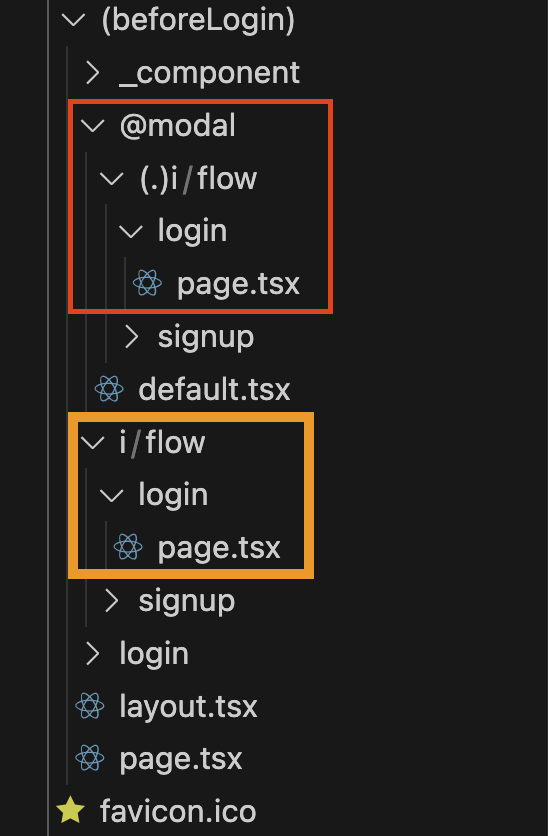
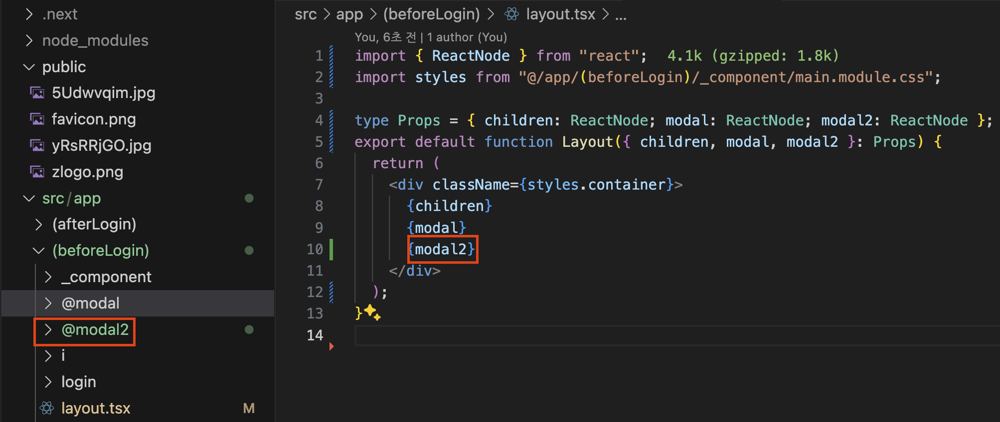

## 강의 메모

### app router와 page router

pages router에서 있는 문제가 구조적 문제가있는데 이를 개선한 app router

-> pages router의 문제점이 무엇인가?

app router에서 개선된점

1. pages router에서 아쉬운, 페이지별 layout이 개선되었다.
2. 페이지별 권한 체크 기능도 미들웨어로 쉽게 쓸수있다.
3. 리액트 18버전을 쓰는데 서버컴포넌트를 적극활용하여 html 로딩시간을 줄이고, 자바스크립트 용량도 줄어든다.
4. 캐싱이 기본적으로 구현되어있다.

### app 폴더 구조

1. 페이지 구조를 정하는것에 있어서 username이 페이지명과 동일하게되면 페이지명이 더 우선순위를 가진다.
   그리고 유저이름을 페이지명과 동일하게 설정이 불가능하도록 막아야한다.

   > 그래서 유저이름에 대해서는 경로가 깊거나, @를 붙이거나 하는것 같음

2. app 폴더 아래에 있는 layout.tsx는 모든 페이지에 공통적으로 적용되는 레이아웃이다.

   만약 특정페이지 전용 layout을 지정하고싶다면 해당 폴더안에 layout을 선언해주면 된다.

   > 특정페이지 구조안에서 추가되는 layout이다.
   >
   > 채널페이지 리스트가 있고 채널 상세페이지 등 채널이라는 큰 타이틀안에서 공통적인 ui를 적용할때 사용한다.

3. 주소창에 관여없이 페이지끼리 그룹을 묶어서할때는 ()를 사용한다

   > 예를들어 로그인전과 로그인후에 화면이 완전히 바뀐다면 동일한 layout을 쓰기 어렵다.
   >
   > 이런상황에서 공통된 layout 관리를 위해 추가 폴더구조를 사용하게되면 원치않는 url구조가 나타날수있다.
   >
   > 이럴때는 (afterLogin), (beforeLogin)과 같은 폴더로 묶게되면 쉽게 공통 layout설정이 가능하다

### layout과 template의 차이

layout은 페이지 이동할때 리렌더링이 발생하지 않지만 template는 리렌더링이 발생한다.

주로 layout을 사용하지만 페이지 이동에 따라 기록이 필요한 경우 template 사용 -> 구글 애널리틱스

### a태그와 Link의 차이점

a태그는 페이지가 새로고침하면서 넘어간다.

-> a태그와 Link와 push, replace 차이점?

### app 폴더 구조에서 redirect

```tsx
// /app/(beforeLogin)/login/page.tsx

import { redirect } from "next/navigation";

export default function LoginPage() {
  redirect("/i/flow/login");
}
```

위와 같은 방식으로 적게되면 /login 접속시 바로 redirect된다.

### 특정 url에 접속하면 모달을 자동으로 띄우는데, 백그라운드에 이전페이지가 남아있도록

> app router의 [Parallel Routes](https://nextjs.org/docs/app/building-your-application/routing/parallel-routes) 이용하기

즉, 서로 다른 두 페이지를 동시에 보여주는 것


같은 폴더내에 위치해야 가능하다.

위 예시에서는 app이라는 폴더아래 page와 layout가 존재하고, 그아래 @team, @analytics가 있다.

그리고 layout에서 나머지 두개를 참조하는 구조이다.

layout에서 page는 children에 위치한다.

### path alias로 설정할 경우

상대경로 표시에서 ../../../와 같이 표시하지 않고

특정 기호 @와 같은것을 사용하여

src의 위치를 절대경로처럼 표기할 수 있다.

### 서버컴포넌트와 클라이언트 컴포넌트

사용하고 있는 모든 컴포넌트는 서버컴포넌트이다.

클라이언트 컴포넌트로 바꾸는 방법은

`use client`를 상단에 입력한다.

그리고는 useState 등을 사용할 수 있게 된다.

### default.tsx

parallel route가 필요없을 때 기본값을 지정하는 파일

모달에 parallel route를 사용한다면 기본값을 null이 될 수 있다.

layout에서 children과 modal을 인자로 받아서 화면에 표시할때

/이면

children -> page.tsx

modal -> @modal/default.tsx

/i/flow/login 이면

children -> /i//flow/login/page.tsx

modal -> @modal/i/flow/login/page.tsx

위와 같은 경우는 모달을 띄울때 예시이고 default.tsx 대신에 page.tsx도 가능하다.

### intercepting route

parallel route이면서 intercepting route를 같이 쓰게 되면

기존 화면 위에 모달을 띄울 수 있게 된다.



위 사진에서 빨간색 부분은 intercepting route 부분이다.

그렇다면 modal 하위에 있는 경로 /@modal/(.)i/flow/login/page.tsx 말고

/i/flow/login/paget.tsx 는 언제 쓰이는가?

이 경로에 있는 페이지는 새로고침시 사용된다.

즉 모달이 띄워지면서 url이 바뀌게 되는데 새로고침을 하게 되면

모달 뒤에 페이지가 사라지고 /i/flow/login/paget.tsx의 컴포넌트가 보여지게 된다.

보통은 똑같이 구현하는데 꼭 똑같지 않아도 된다.

> 주의할점은 기존화면 위에 모달을 띄우게 될경우 기존 화면은 이전 페이지가 된다.
>
> 그래서 / -> /I/flow/signup 이면
>
> 메인 위에 회원가입 모달이 뜨게되는데
>
> / -> /login -(redirect)-> /i/flow/login 이면
>
> /login 이라는 페이지 위에 뜨게 되는 것이므로 /login을 구현하지 않았다면
>
> 뒷 배경이 아무것도 없을 수도 있다 주의 !

### \_private folder

app router 아래에 생성할 수 있는 폴더이며

\_를 붙여서 만들 수 있다.

이 경우도 주소창에 뜨지 않는다.

컴포넌트 폴더를 만들때 사용할 수 있다.

### replace vs push

push
/ -> /login -> /i/flow/login

replace
/ -> /i/flow/login

push의 경우는 뒤로가기를 눌렀을때 /login으로 가지만

replace의 경우는 메인으로 가게 된다.

### 여러개의 모달



한페이지 내에서 뒷 배경을 유지하면서, 여러개의 모달을 띄우고자 한다면

모달을 추가하고 layout에서도 추가해주면 된다.
